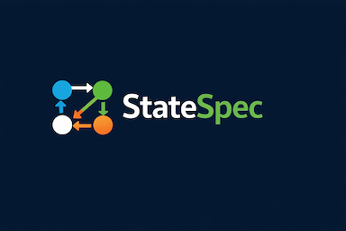

# 📦 StateSpec

> **Design systems with zero ambiguity.**

StateSpec is a **canonical language for designing distributed systems**—unifying **entities, APIs, workflows, and state machines** into a single, deterministic specification.

It replaces ambiguous design docs with a **structured, executable spec** that can generate code, enforce invariants, and keep system architecture consistent over time.

---

# 🚀 Why StateSpec?

Modern systems are hard to reason about because:

- APIs are defined separately from workflows  
- State transitions are implicit or undocumented  
- Workers and control planes drift from original design  
- Prose specs are ambiguous and quickly outdated  

**StateSpec solves this by making system behavior explicit, structured, and canonical.**

---

# 🧠 Core Idea

> A system is a set of **entities with lifecycles**, manipulated by **APIs**, and executed by **workflows**.

StateSpec encodes all three in one place:

- **Entities** → state, relationships, invariants  
- **APIs** → intent and external contracts  
- **Workflows** → asynchronous execution and orchestration  

---

# 🧩 What You Get

From a single `.sspec` file, StateSpec can generate:

- OpenAPI specifications  
- Protobuf / gRPC schemas  
- Server stubs (Go, Java, Rust, C++)  
- Worker skeletons  
- State machine validators  
- Test scaffolding  
- Architecture documentation  

---

# ⚙️ Design Principles

StateSpec is built around **low-entropy system design**:

### 1. Canonical Structure  
One way to express each concept.

### 2. Explicit State  
All lifecycles are defined as state machines.

### 3. Deterministic Behavior  
No hidden side effects or implicit transitions.

### 4. Separation of Concerns  
- Domain (entities)  
- Interface (APIs)  
- Execution (workflows)  
- Realization (storage, infra)

### 5. Text is the Source of Truth  
Visual tools never replace the canonical spec.

---

# 🔗 Parent–Child Model

StateSpec natively supports hierarchical systems:

- Parent entities **own** child entities  
- Parent workflows **create and orchestrate children**  
- Child workflows execute independently  
- Parent progress is derived from **child entity state**

> Workflows communicate through **durable entity state**, not transient execution state.

---

# 🔄 Orchestration Model

StateSpec standardizes orchestration as a **three-phase protocol**:

1. **generate_child_ids**  
2. **creating_children**  
3. **waiting_children**

This makes orchestration:

- idempotent  
- observable  
- restart-safe  
- deterministic  

---

# 💻 CLI (Planned)

statespec validate  
statespec fmt  
statespec generate  
statespec graph  
statespec diff  

---

# 🧠 VS Code Extension

StateSpec is designed to be used with a **Visual Studio Code extension**:

- Syntax highlighting  
- Real-time validation  
- Autocomplete  
- Symbol navigation  
- Entity/workflow graph visualization  
- Code generation commands  

---

# 📂 File Extension

.sspec

---

# 🎯 Use Cases

- Cloud control planes  
- Infrastructure services  
- Event-driven systems  
- API + worker architectures  
- Systems with complex lifecycle management  

---

# 🔍 Comparison

| Tool        | Scope              | Limitation                  |
|-------------|-------------------|----------------------------|
| OpenAPI     | APIs              | No workflows or state      |
| Terraform   | Infrastructure    | No runtime behavior        |
| UML         | Diagrams          | Not executable             |
| Prose Docs  | Everything        | Ambiguous, inconsistent    |

**StateSpec** → Unified, executable system design

---

# 🛣️ Roadmap

- Language spec v0.1  
- Parser + validator  
- CLI (`validate`, `fmt`)  
- VS Code extension  
- Graph visualization  
- Code generators  

---

# 🤝 Contributing

See CONTRIBUTING.md

---

# 📜 License

Apache 2.0 (recommended)

---

# 🧭 Positioning

StateSpec is a **canonical design language for distributed systems** that unifies APIs, state machines, and workflows into a single, deterministic specification.

---

# 🧠 Philosophy

> Systems fail when design is implicit.

---

# 🚀 One-Line Summary

> From state machines to running systems.
